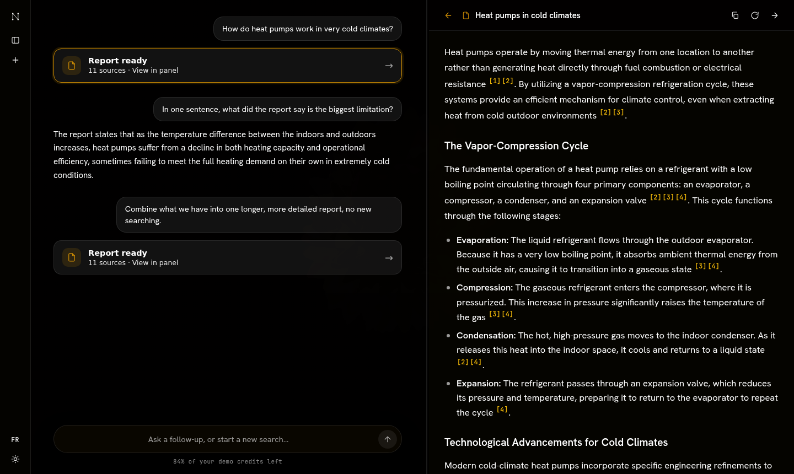
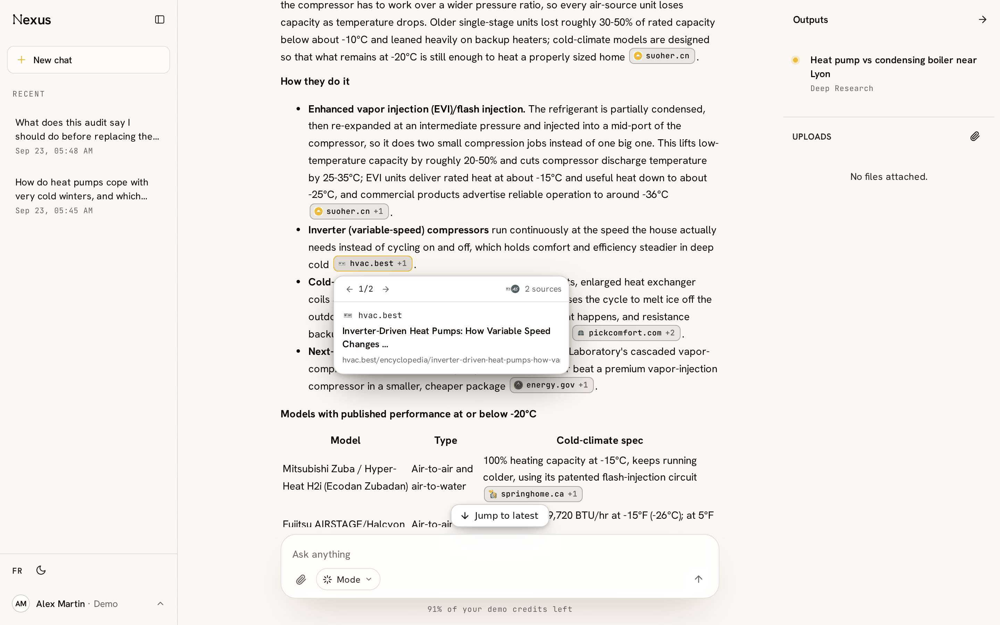
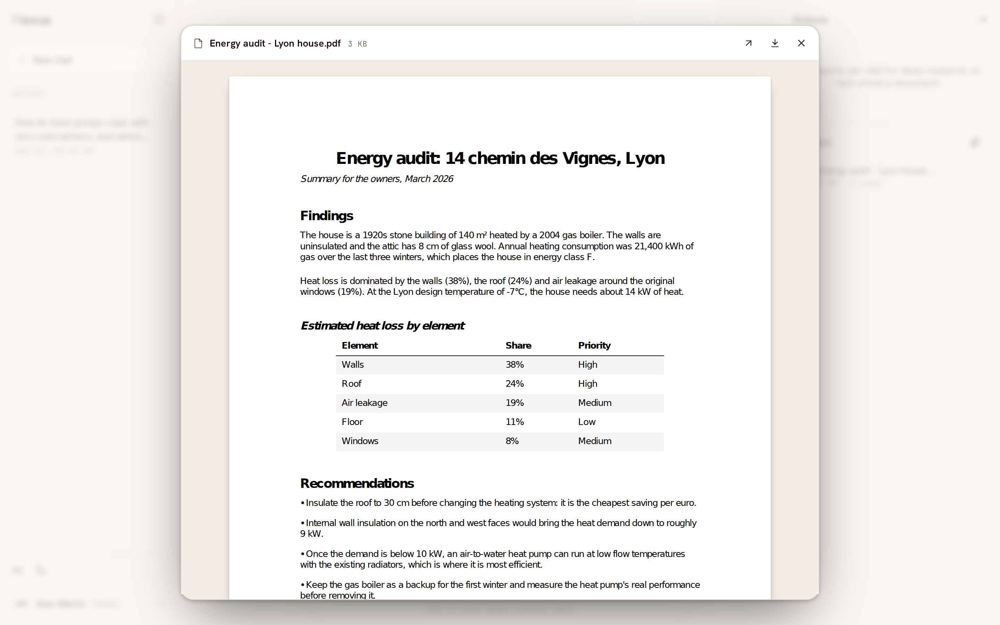
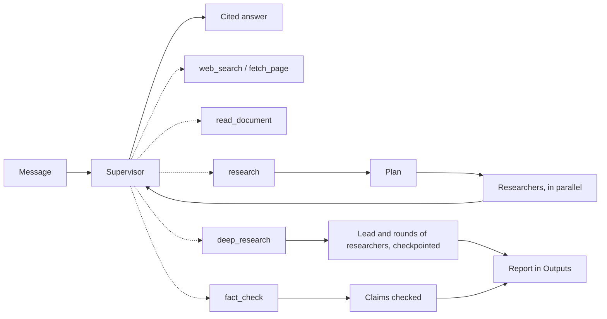

# Nexus

Nexus is a research assistant.
You ask a question, a small team of AI agents researches it on the web, and you get back one report where every claim links to the source it came from.

Live demo: [nexus.ghalibenbouzid.com](https://nexus.ghalibenbouzid.com) (invite-only, [ask me for an account](https://www.linkedin.com/in/ghali-ben-bouzid-6b6582268)).



## The problem

A search engine gives you links to read yourself.
A chatbot gives you an answer, but you can't easily tell where each part of it comes from.
Nexus does the reading for you, and every sentence in its report points to a numbered source you can open and check.

It's for anyone who wants a researched answer and wants to see where each part of it came from.
It's also my portfolio project: I use it to show how I build an agent system, including how it runs in production and how I measure it.

## What goes in, what comes out

You type a message in a chat, and Nexus answers it.

How much work that takes is its own judgement, not a mode you pick.
A follow-up it can already answer comes back immediately.
A question that needs one fact gets one search.
A real question gets a team of researchers working in parallel, and the answer comes back in the conversation with every claim cited to a page that was actually read.
Each citation is a small pill that names the site it came from, and opening it shows the pages behind the claim.



Two kinds of work produce a document rather than a reply:

- **Deep research**, when you want a question properly covered. A lead agent sends researchers out in rounds, reads what comes back, and goes back for the gaps, the disagreements and the angles nobody took, until it judges the question answered for what you need it for. Then it writes its own report, several paragraphs per section, and shorter when little could be found. Before it starts, the supervisor settles what the report is for: depth or breadth, and which areas. When a request is too broad to tell, it asks, with a few options and a "your call" choice. It runs in the background and survives a redeploy, so you can close the chat and come back to it, and if you change your mind while it works, the supervisor passes that on and the lead adjusts its next round.
- **A fact check** of a file you upload: it sets down the claims the document rests on, each tied to the passage it comes from, tests each against the web, and writes a report saying which held up.

Both are also modes you can switch the composer into.
A mode tells the supervisor what you are after, and the supervisor still reads the message: "hi" in deep mode gets a reply, not a ten-minute run.
Either way the run is the same, and so is where it ends up.

Both land in **Outputs**, and you are told when one is ready wherever you happen to be.

Files come in by the attach button or by dropping them anywhere on the page.
A file shows up in the conversation the moment you add it, says while it is being read, and says so if it could not be.
Any file, in the thread, in the composer or in the side panel, opens in a viewer inside the app: a PDF as real pages with selectable text, a Word file, Markdown or plain text as a document.



## How it works



The dotted arrows are tools.
The supervisor decides which to use and how many times, and then writes the answer itself.
Nothing is a route: "does this need research?" is judgement, which a model does well and a classifier does badly.

The browser never waits on the models.
The API saves your message and puts a job on a queue, a separate worker runs the agents, and the browser holds a stream open so the model's thinking and its answer appear as they are written.

What each piece is used for:

| Piece | Used for |
| --- | --- |
| FastAPI | The API: accounts, conversations, starting and stopping runs, the progress feed |
| Redis + arq | The job queue between the API and the worker |
| LangGraph | The deep research run as a checkpointed graph, so a deploy mid-run costs one step |
| LangChain | The agents themselves, their tools and their prompts |
| Postgres (SQLAlchemy, Alembic) | Conversations, runs, progress events, the usage ledger, and deep-run checkpoints |
| OpenRouter | The language models, through one OpenAI-compatible endpoint |
| SearXNG | Web search: a metasearch proxy we run ourselves, so searching costs nothing |
| Crawl4AI | Reading a page: fetches it in a real browser and returns pruned markdown |
| DeepEval | Scoring the evaluation runs |
| LangSmith | Optional tracing of every agent step |
| React + TypeScript + Vite | The chat interface and the report panel |
| pdf.js, mammoth | Showing an uploaded PDF or Word file inside the app |
| Railway, Neon, Cloudflare | Hosting for the API and worker, the database, and the frontend |

Each agent is a LangChain agent: a prompt, a set of tools and the loop that runs them.

- The **supervisor** is the one you talk to. It answers, and when answering well needs work it has not done yet, it does that work first.
- The **planner** splits a research question into self-contained sub-questions, as many as it genuinely needs: a plain fact gets one or two, a three-way comparison gets six.
- The **lead** runs a deep research run instead of the planner. It sends a round of up to six researchers, reads what they found, and either sends another round or hands the writer an outline. It gets three rounds and fifteen researchers at most, and every agent is told when its next step is its last, so it synthesises rather than getting cut off.
- Each **researcher** searches the web and reads pages in a loop, then submits claims with the sources behind them. It has a budget of three searches (five in a deep run) and is told to choose its queries carefully and read pages in full instead.
- The **fact checker** reads a document and first commits to the claims it rests on, each tied to its passage, naming what it leaves out and why. Nothing is searched until that list is confirmed; then it tests each claim against independent sources.
- Writing a report is not an agent: by then there is nothing to decide, so it is one model call in the same house style the chat answers in.

## Decisions and trade-offs

**Citations are assigned by code, not by the model.**
Left to cite on their own, models sometimes cite a page they never read.
So a registry numbers each source as a tool returns it, and an agent can only cite a number it was handed; anything else is stripped before you see it.
One registry per turn means the supervisor's own searches and its researchers' findings share one numbering, so merging findings is a remap rather than a renumber.
In exchange, nothing in an answer can go beyond what was actually retrieved.

**The agents run on LangChain's loop, with our own concerns as middleware.**
Writing the tool loop by hand is a day's work; keeping it correct is not, and the framework's loop comes with structured output, tool errors and retries already thought through.
What the app cannot delegate rides alongside it: billing and pacing hang on the model itself, because middleware only sees an agent's calls and two of our four agents call the model directly.
That distinction was worth finding: the first version billed only what agents spent.

**Prompts are versioned objects, not strings in the code.**
Each agent's prompt is a LangChain template in `app/prompts` carrying a version, and a lock file pins that version to a hash of its text, so a test fails if the wording changes without a bump.
Every eval run records the versions it used, which is what makes "did this prompt change help?" a question with an answer.
The cost is a little ceremony on every prompt edit.

**The conversation reaches the model as real messages.**
It used to be flattened into one long user message where your words, the app's labels and past report excerpts all looked alike.
Now each turn is its own message, and anything retrieved (a past report, search results, a fetched page) arrives inside a tag that the prompts define as data, never instructions.
A page that says "ignore your instructions" reads as page content.

**A queue and a worker instead of running agents inside the API.**
A research run takes from a few seconds to a few minutes, and it used to run inside the API process, so a redeploy killed it.
Now the worker runs it and writes a heartbeat every few seconds, and a scheduled check fails any run whose heartbeat stops.
It does mean one more service to deploy (Redis) and a second process to keep alive.

**No plan approval.**
Nexus used to propose a plan and wait for you to confirm it.
It was a form in front of the user before a single search had been made, and it made a simple follow-up as heavy as a full run.
The supervisor decides what work a message needs and does it; if a question deserves minutes, it says so and starts a deep run in the background instead of asking permission.

**LangGraph only where a run is long enough to be interrupted.**
A normal research run is one fan-out, which `asyncio` already expresses, so it is plain code.
Deep research takes minutes, which is long enough that a deploy will land in the middle of one, so it is a graph over a Postgres checkpointer: every node lands in a checkpoint, and a worker that picks the run back up starts from the last step that finished rather than re-paying for the rounds and researchers that already came back.
The reaper hands a stalled deep run back to a worker; everything else it fails, because restarting those would only re-bill work already paid for.
The downside is that the checkpointer keeps its own tables outside my migrations.

**One house style, two modes.**
The chat and every report share one prompt for voice and structure, with a chat mode and a report mode.
A report and a reply read as the same product rather than as two, and changing how Nexus sounds is one edit.

**A run is a row with a kind.**
A chat turn, a deep research run and a fact check all need an owner, a status, a heartbeat, a live event feed, a stop button and a bill.
So they are one table with a `kind` rather than three, and everything built around a run works for all three without being written three times.

**Invite-only accounts with a dollar budget.**
The demo runs on paid models, so there's no public signup.
I create each account with a budget, every model call is priced and written to a ledger, and new work is refused once the budget is spent.
The catch is that I hand out accounts myself.

**Streaming over a bus, with the database still underneath.**
The model runs in the worker and the browser talks to the API, so the two are joined by Redis: the worker publishes each frame, the API forwards it over server-sent events.
Stages are still written to Postgres and replayed when a stream opens, so a reload or a dropped connection costs a redraw rather than the answer.
Tokens are never stored, because the reply is saved whole when the turn ends.

## What went wrong along the way

**Every report said nothing was found.**
Searches were returning results, but every researcher's final answer failed validation.
The first evaluation run made it obvious: researcher success was 0% across 41 research runs.
The cause was the tool definitions: they used JSON Schema references, which the model behind OpenRouter didn't follow, so it sent the claims as plain strings.
Writing the schemas out in full fixed it, and researcher success went to 100% on the next run.

**A question about me came back in German.**
Language detection tripped on my name: it read "Who is Ghali Ben Bouzid?" as Dutch and "Qui est Ghali Ben Bouzid ?" as German, and every agent followed it, so one report came back in German.
Detection now needs a minimum confidence before it sets the language.

**A slower model made runs time out.**
I tried a reasoning model that spent close to a minute per researcher step and three minutes writing, so runs hit the global timeout and lost everything.
Researchers now have a shared time budget after which they submit what they have, and if the writer runs out of time, the report is built directly from the findings.
I also went back to a faster default model.

**Every question about me was researched from the web.**
Asked "who is Ghali Ben Bouzid?" or "what is Nexus?", the supervisor had nothing to answer from, so it searched, and came back with details about other people.
The evaluation caught it, and the supervisor prompt now carries what it needs to know about the app and about me.
Routing on those questions went from 15 of 24 correct to 24 of 24, and it stopped searching for them entirely.

**Reports treated the training cutoff as the present.**
Only the writer knew today's date, so the planner asked researchers for the latest Python version "as of 2025", and a current-events report presented 2024 as current.
Every agent is now told today's date.
Adding the date alone helped; the extra rules I wrote around it made things worse, and measuring the two separately is what showed that.

**Stopping a run didn't stop the model.**
Stopping during the writing step marked the run as stopped, but the writer's model call kept going, got billed, and its report was thrown away.
The worker now cancels whatever is running, a model call included, within one heartbeat of the stop.

**Deep research came back shallow, then as a course, then as a summary.**
The first deep runs planned once, sent one wave of researchers and wrote, so "educate me on meteorology" got one pass at the subject.
Making the lead loop over rounds fixed the coverage and overshot: one test ran for 32 minutes and wrote 22,822 words.
Telling it to go deep only where the user's goal needed it overcorrected the other way, to 800 to 1,200 words spread over six sections of one paragraph each.
The lead now picks a few areas the brief turns on, maps them in a first round and goes back into the thin ones as the normal case, with several paragraphs per section: three rounds, 3,728 words and 69 cited sources on the run that settled it.

**Deep runs came back hollow for two unrelated reasons.**
A researcher that ran out of rounds could submit "I found something" with no claims, because claims were optional in its schema; they are now required, and an empty submission is sent back.
And a deep round's researchers searching at once reached the engines behind SearXNG as one burst, which they blocked for minutes (a CAPTCHA from Google, access denied from DuckDuckGo, a 429 from Brave) while SearXNG still answered with an empty success.
An empty search is now an error the researcher sees, each researcher has a small search budget, and every search the worker sends is paced at 40 a minute.

**Two fact checks of the same document checked different things.**
The checker picked its three to ten claims silently, somewhere inside its search loop, so nothing ever reviewed the choice.
It now sets its claims down before searching, each tied to its passage, and a review checks that every passage is covered or set aside and that no two claims would be settled by the same evidence.

## Evaluation

`app/evals/goldens.toml` holds 150 realistic first messages.
They cover questions about the app and about me, current events, facts, comparisons, how-to questions, false premises, unanswerable and multilingual questions, and a stress set with typos, prompt injections and malformed input.
Each one says what a good response should do.

The harness runs them through the real turn and records everything it did: which tools the supervisor reached for, the plan, each researcher's searches and claims, the answer, the cost and the time.
Two seams make the inside of a tool visible without changing what a turn does: a context variable that tags each search with the researcher that made it, and a hook that hands over each research run's result.
It scores each stage two ways.

**Scoring a run on its own.**
Deterministic checks (did the run finish, does every citation resolve, did it research when the question needed research) plus DeepEval metrics judged by a separate model (is the plan relevant, is the report faithful to the findings, does the response do what the question needed).
This is what the first two runs used, on `google/gemini-3.1-flash-lite` with `openai/gpt-5-mini` as the judge:

| Metric | First baseline (60 questions) | After the schema fix (6 questions) |
| --- | --- | --- |
| Researcher success | 0% | 100% |
| Report faithfulness to findings | n/a | 1.00 |
| Citation validity | 100% | 100% |
| Routing correct | 79% | 80% |
| Response does what was expected | 23% | 67% |
| Mean time per run | 9 s | 12 s |
| Mean cost per run | $0.01 | $0.01 |

The first run found the bug that mattered most: researcher success was 0% across 41 research runs, because the tool schemas used JSON Schema references the model never followed.
The second run, six questions after the fix, showed it working.
It also showed two problems those averages hide: a current-events report presented 2024 information as current, and a question about me went to web search and came back with invented details.

**Comparing two versions head to head.**
Averages move less than the judge's own noise when a prompt changes by a sentence, so `python -m app.evals compare <run A> <run B>` judges the two answers to the same question against each other with DeepEval's ArenaGEval, which hides which version wrote which.
Each pair is judged twice and a split counts as a tie, and the report says how often the two judgments agreed, which is the signal for whether the judge is guessing.
Runs can stop the moment a plan exists (`collect --until plan`), so a change to the supervisor's judgement or to planning is measured for the price of two calls, before anything has searched.

That loop is how the prompts got fixed, each change measured against the version before it, on `z-ai/glm-5.3-flash` with `openai/gpt-oss-120b` as the judge:

| Change | Measured on | Result |
| --- | --- | --- |
| Give the supervisor, planner and researcher today's date | 8 time-sensitive questions | Wins 3-2 on the answers, 2-0 on the plans. "Latest stable Python" stopped being planned "as of 2025", and "what's today's date?" stopped being refused |
| Tell the supervisor what Nexus is and who built it | 24 questions about the app and me | Routing 15/24 to 24/24 correct, supervisor web searches 12 to 0, wins 12 of 15 judged pairs, 35% cheaper |
| Send the conversation as real messages with tagged blocks | the same 24 | Wins 13, loses 6, 5 ties: no regression, and an injected "ignore your instructions" inside a report block did not take over |
| Let the planner size the plan, up to six sub-questions | 8 broad questions | Comparisons went from 3 to 6 angles, narrow questions stayed small. The plan judge prefers the old narrow plans, so this one is not settled |

Two honest notes about the judge.
It moved from `openai/gpt-5-mini` to `openai/gpt-oss-120b`, about a sixth of the cost, after the cheaper model agreed with the expensive one on 90% of verdicts in a side-by-side run.
It is not neutral about style: in several pairs it preferred the shorter of two correct answers, and on the plans its criteria penalize extra angles as drift, which is why the breadth change stays an open question until reports are compared rather than plans.

Scoring the full 150-question set is still the next step.

## Tests

- The backend has nearly 300 tests with pytest, and they run offline: a fake model and a fake search backend script the agents, so the suite is fast and deterministic.
- They cover the supervisor and its tools, the research fan-out, the deep run resuming from its checkpoint after a worker dies, fact-checking a document, stopping a run, the job queue, budgets and billing, and the API.
- The frontend has about 70 Vitest tests for the logic behind citations, the progress feed, the stream parser, credits, uploads and file previews.
- Ruff for linting, and the TypeScript compiler for type checking.

## Limitations

- Access is invite-only, and I create accounts by hand.
- Research covers the web only; searching your own documents isn't built yet.
- A chat turn or a fact check whose worker crashes is failed, not resumed; only deep runs pick up where they stopped.
- A deep run takes around fifteen minutes on the default model, most of it spent waiting on the slowest researchers.
- The search engines behind SearXNG can still block a busy worker for minutes; pacing makes it rare, and a blocked run writes a shorter report that says what it could not establish.
- A stream that drops is not resumed automatically; reopening the conversation rejoins the run.
- Slow reasoning models don't fit the time budget and fall back to a less polished report.
- The evaluation relies on a model as a judge, and the scored runs so far are small.
- Prompt injection defences are written and structured, but not yet measured on full research runs.

## Licence

Nexus is licensed under the [GNU AGPL v3](LICENSE).
It reads PDFs with PyMuPDF, which is AGPL, so the app it is part of is too.

## Who built what

I designed Nexus and made every decision in it: the architecture, how the agents work, what the evaluation measures and how the interface looks and behaves.
I wrote the first versions of the agents myself.
From there I worked with Claude Code as a coding assistant, on the later production work (the queue and worker split, the move to LangGraph, the evaluation harness, the invite accounts, the prompt work) and on the interface I designed.
I reviewed and tested what it wrote, and the calls about what to build, and what to keep, were mine.

## Run it locally

You need [uv](https://docs.astral.sh/uv/), Postgres, Redis, Docker and Node.

```bash
uv sync
cp .env.example .env                  # fill in DATABASE_URL, SECRET_KEY, OPENROUTER_API_KEY
docker compose -f docker-compose.search.yml up -d   # SearXNG + Crawl4AI
uv run alembic upgrade head
uv run uvicorn main:app --reload      # the API, on http://localhost:8000
uv run arq app.worker.WorkerSettings  # the worker, in a second terminal
```

Without Redis, set `JOB_QUEUE=inline` and the jobs run inside the API process.

The two search services have to be your own: SearXNG ships with JSON output
switched off, so public instances answer an API call with a 403. The settings
file in `deploy/searxng/` turns it on, and nothing in that stack needs to face
the internet. If you would rather not run them, leave `SEARXNG_URL` unset and
set `TAVILY_API_KEY` instead; the app picks whichever is configured.

Create an account and its invite link (there is no signup page):

```bash
uv run python -m app.admin create "Jane Doe" --budget 0.5 --days 14
uv run python -m app.admin list
uv run python -m app.admin delete 1   # the account, its conversations and its uploaded files
```

Then the frontend:

```bash
cd frontend
npm install
cp .env.example .env    # VITE_LIVE_MODE=true and VITE_API_BASE_URL=http://localhost:8000
npm run dev             # http://localhost:5173
```

Tests and evaluation:

```bash
uv run pytest
uv run ruff check .
cd frontend && npm test && npm run build

uv run python -m app.evals run --category owner,current   # a slice; spends model, search and judge credits
```

## Deployment

Nexus is set up to run on Railway (API, worker and Redis), Neon (Postgres) and Cloudflare (frontend).

1. **Neon:** create a database and use its connection string in the `postgresql+asyncpg://` form, with `DATABASE_SSL=true`.
2. **Railway, Redis:** add a Redis service; its private URL is `REDIS_URL`.
3. **Railway, API:** deploy from the root `Dockerfile`, which runs the migrations and starts the API. Set the variables from `.env.example`, and give the OpenRouter key a hard credit limit.
4. **Railway, worker:** a second service from the same repository and `Dockerfile`, with the same variables, the start command `arq app.worker.WorkerSettings` and no public domain.
5. **Railway, SearXNG:** a service from this repository with the root directory `deploy/searxng`, which builds `searxng/searxng` with our settings file inside it. JSON output has no environment variable, so the file has to travel in the image. Set `SEARXNG_SECRET` to any long random string. No public domain.
6. **Railway, Crawl4AI:** a service from the public image `unclecode/crawl4ai`. Set `CRAWL4AI_API_TOKEN`, because the server asks for a credential once it is reachable from anywhere but localhost. No public domain. Give it about 2GB: it runs a real browser.
7. **Point the API and the worker at them:** `SEARXNG_URL=http://searxng.railway.internal:8080`, `CRAWL4AI_URL=http://crawl4ai.railway.internal:11235`, and `CRAWL4AI_TOKEN` matching the token above. Both variables have to be set, on both services, or the app falls back to Tavily.
8. **Cloudflare:** build the `frontend` folder with `npm run build`, serve `dist`, and set `VITE_API_BASE_URL` and `VITE_LIVE_MODE=true`. Then set `CORS_ORIGINS` on the API to the frontend's address.

## Where things are

- [`app/agents/supervisor.py`](app/agents/supervisor.py): the agent you talk to, and the tools it reaches for
- [`app/agents/deep.py`](app/agents/deep.py): the deep run's lead and its graph
- [`app/agents/`](app/agents/): the planner, the researcher, the fact checker and the report writer
- [`app/prompts/`](app/prompts/): the agents' prompts, as versioned LangChain prompt templates
- [`app/research/service.py`](app/research/service.py): what every run shares before it does its own work
- [`app/jobs.py`](app/jobs.py) and [`app/worker.py`](app/worker.py): the queue and the worker
- [`app/billing/`](app/billing/): budgets and the usage ledger
- [`app/evals/`](app/evals/): the evaluation harness and the 150 questions
- [`frontend/src/`](frontend/src/): the React app
- [`tests/`](tests/): the backend test suite

## What's next

- Researching your own documents alongside the web.
- Scoring the full 150-question set, then picking a model per agent from the results.
- Measuring the prompt injection defences, now that searching is self-hosted and costs nothing.
- Making deep research faster, starting with the researchers that hold a round back.
