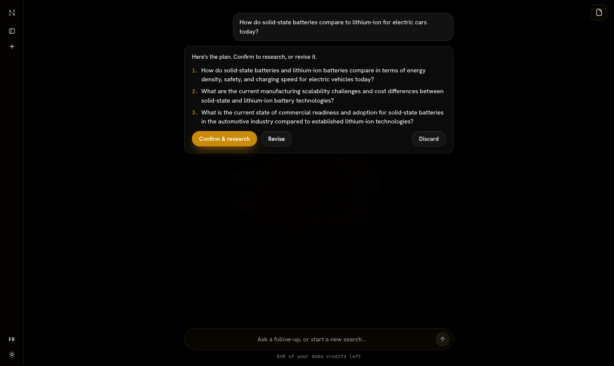
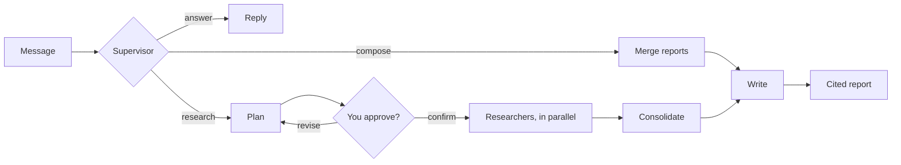

# Nexus

Nexus is a research assistant.
You ask a question, a small team of AI agents researches it on the web, and you get back one report where every claim links to the source it came from.

Live demo: [nexus.ghalibenbouzid.com](https://nexus.ghalibenbouzid.com) (invite-only, [ask me for an account](https://www.linkedin.com/in/ghali-ben-bouzid-6b6582268)).


## The problem

A search engine gives you links to read yourself.
A chatbot gives you an answer, but you can't easily tell where each part of it comes from.
Nexus does the reading for you, and every sentence in its report points to a numbered source you can open and check.

It's for anyone who wants a researched answer and wants to see where each part of it came from.
It's also my portfolio project: I use it to show how I build an agent system, including how it runs in production and how I measure it.

## What goes in, what comes out

You type a message in a chat.
Nexus reads the conversation and does one of three things:

- **Answers directly**, when the conversation and the reports already in it cover the question.
- **Merges earlier reports** into one longer report, with no new searching, when you ask it to combine them.
- **Researches**: it proposes a plan, waits for you to approve or revise it, then writes a cited report.

A real example from the local setup:

> **You:** How do heat pumps work in very cold climates?
>
> **Plan proposed, waiting for approval:**
> 1. What is the fundamental operating principle of heat pumps and how does it function when extracting heat from cold outdoor air?
> 2. What technological advancements allow modern heat pumps (such as cold-climate air-source heat pumps) to maintain efficiency and heating capacity in sub-zero temperatures?
> 3. What are the limitations and performance trade-offs of using heat pumps as the primary heating source in extremely cold climates?
>
> **After approval:** three researchers searched in parallel and the report came back with 11 cited sources, about 8 seconds later.



## How it works



The browser never waits on the models.
The API saves your message and puts a job on a queue, a separate worker runs the agents, and the frontend polls for progress and shows each step as it happens.

What each piece is used for:

| Piece | Used for |
| --- | --- |
| FastAPI | The API: accounts, conversations, starting and stopping runs, the progress feed |
| Redis + arq | The job queue between the API and the worker |
| LangGraph | The agent pipeline as a graph, including the pause for plan approval |
| LangChain | The agents' prompts, as versioned templates |
| Postgres (SQLAlchemy, Alembic) | Conversations, runs, progress events, the usage ledger, and paused runs |
| OpenRouter | The language models, through one OpenAI-compatible adapter |
| Tavily | Web search and reading pages |
| DeepEval | Scoring the evaluation runs |
| LangSmith | Optional tracing of every agent step |
| React + TypeScript + Vite | The chat interface and the report panel |
| Railway, Neon, Cloudflare | Hosting for the API and worker, the database, and the frontend |

The agents themselves are plain Python and know nothing about LangGraph:

- The **supervisor** reads the conversation and picks the route.
- The **planner** splits the question into self-contained sub-questions, as many as the question needs and at most six: a plain fact gets one or two, a three-way comparison gets six.
- Each **researcher** searches the web and reads pages in a loop, then submits claims with the sources behind them.
- The **consolidator** is plain code, not a model: it removes duplicate sources and numbers them.
- The **writer** turns the claims into a report, and a final check removes any citation number that doesn't match a real source.

## Decisions and trade-offs

**Citations are assigned by code, not by the model.**
Left to cite on their own, models sometimes cite a page they never read.
So the consolidator numbers the sources and the writer can only keep the numbers it was given.
In exchange, the writer can't add anything the researchers didn't find.

**Prompts are versioned objects, not strings in the code.**
Each agent's prompt is a LangChain template in `app/prompts` carrying a version, and a lock file pins that version to a hash of its text, so a test fails if the wording changes without a bump.
Every eval run records the versions it used, which is what makes "did this prompt change help?" a question with an answer.
The cost is a little ceremony on every prompt edit.

**The conversation reaches the model as real messages.**
It used to be flattened into one long user message where your words, the app's labels and past report excerpts all looked alike.
Now each turn is its own message, and anything retrieved (a past report, search results, a fetched page) arrives inside a tag that the prompts define as data, never instructions.
A page that says "ignore your instructions" reads as page content.

**A queue and a worker instead of running agents inside the API.**
A research run takes from a few seconds to a few minutes, and it used to run inside the API process, so a redeploy killed it.
Now the worker runs it and writes a heartbeat every few seconds, and a scheduled check fails any run whose heartbeat stops.
It does mean one more service to deploy (Redis) and a second process to keep alive.

**LangGraph with a Postgres checkpointer for the plan approval.**
Before, approving a plan meant ending one job and starting another one from values saved on the database row.
Now the graph pauses on the plan, saves its state, and the same run resumes when you answer, even on a different worker.
Two downsides: the checkpointer keeps its own tables outside my migrations, and it only saves when a run pauses or ends, so if a worker crashes mid-run, that run fails instead of picking back up.

**Invite-only accounts with a dollar budget.**
The demo runs on paid models, so there's no public signup.
I create each account with a budget, every model call is priced and written to a ledger, and new work is refused once the budget is spent.
The catch is that I hand out accounts myself.

**Polling instead of streaming.**
The frontend asks for new progress events every second and a half instead of holding a stream open.
It's simpler to host and to recover from a dropped connection, at the price of more requests.

## What went wrong along the way

**Every report said nothing was found.**
Searches were returning results, but every researcher's final answer failed validation.
The first evaluation run made it obvious: researcher success was 0% across 41 research runs.
The cause was the tool definitions: they used JSON Schema references, which the model behind OpenRouter didn't follow, so it sent the claims as plain strings.
Writing the schemas out in full fixed it, and researcher success went to 100% on the next run.

**A question about me came back in German.**
Language detection tripped on my name: it read "Who is Ghali Ben Bouzid?" as Dutch and "Qui est Ghali Ben Bouzid ?" as German, and every agent followed it, so one report came back in German.
Detection now needs a minimum confidence before it sets the language.

**A slower model made runs time out.**
I tried a reasoning model that spent close to a minute per researcher step and three minutes writing, so runs hit the global timeout and lost everything.
Researchers now have a shared time budget after which they submit what they have, and if the writer runs out of time, the report is built directly from the findings.
I also went back to a faster default model.

**Every question about me was researched from the web.**
Asked "who is Ghali Ben Bouzid?" or "what is Nexus?", the supervisor had nothing to answer from, so it searched, and came back with details about other people.
The evaluation caught it, and the supervisor prompt now carries what it needs to know about the app and about me.
Routing on those questions went from 15 of 24 correct to 24 of 24, and it stopped searching for them entirely.

**Reports treated the training cutoff as the present.**
Only the writer knew today's date, so the planner asked researchers for the latest Python version "as of 2025", and a current-events report presented 2024 as current.
Every agent is now told today's date.
Adding the date alone helped; the extra rules I wrote around it made things worse, and measuring the two separately is what showed that.

**Stopping a run didn't stop the model.**
Stopping during the writing step marked the run as stopped, but the writer's model call kept going, got billed, and its report was thrown away.
The worker now cancels whatever is running, a model call included, within one heartbeat of the stop.

## Evaluation

`app/evals/goldens.toml` holds 150 realistic first messages.
They cover questions about the app and about me, current events, facts, comparisons, how-to questions, false premises, unanswerable and multilingual questions, and a stress set with typos, prompt injections and malformed input.
Each one says what a good response should do.

The harness runs them through the real pipeline and records every stage: the routing decision, the plan, each researcher's searches and claims, the report, the cost and the time.
It scores each stage two ways.

**Scoring a run on its own.**
Deterministic checks (did the run finish, does every citation resolve, did the route match) plus DeepEval metrics judged by a separate model (is the plan relevant, is the report faithful to the findings, does the response do what the question needed).
This is what the first two runs used, on `google/gemini-3.1-flash-lite` with `openai/gpt-5-mini` as the judge:

| Metric | First baseline (60 questions) | After the schema fix (6 questions) |
| --- | --- | --- |
| Researcher success | 0% | 100% |
| Report faithfulness to findings | n/a | 1.00 |
| Citation validity | 100% | 100% |
| Routing correct | 79% | 80% |
| Response does what was expected | 23% | 67% |
| Mean time per run | 9 s | 12 s |
| Mean cost per run | $0.01 | $0.01 |

The first run found the bug that mattered most: researcher success was 0% across 41 research runs, because the tool schemas used JSON Schema references the model never followed.
The second run, six questions after the fix, showed it working.
It also showed two problems those averages hide: a current-events report presented 2024 information as current, and a question about me went to web search and came back with invented details.

**Comparing two versions head to head.**
Averages move less than the judge's own noise when a prompt changes by a sentence, so `python -m app.evals compare <run A> <run B>` judges the two answers to the same question against each other with DeepEval's ArenaGEval, which hides which version wrote which.
Each pair is judged twice and a split counts as a tie, and the report says how often the two judgments agreed, which is the signal for whether the judge is guessing.
Runs can stop after planning (`collect --until plan`), so a change to routing or planning is measured without paying for researchers or searches.

That loop is how the prompts got fixed, each change measured against the version before it, on `z-ai/glm-5.3-flash` with `openai/gpt-oss-120b` as the judge:

| Change | Measured on | Result |
| --- | --- | --- |
| Give the supervisor, planner and researcher today's date | 8 time-sensitive questions | Wins 3-2 on the answers, 2-0 on the plans. "Latest stable Python" stopped being planned "as of 2025", and "what's today's date?" stopped being refused |
| Tell the supervisor what Nexus is and who built it | 24 questions about the app and me | Routing 15/24 to 24/24 correct, supervisor web searches 12 to 0, wins 12 of 15 judged pairs, 35% cheaper |
| Send the conversation as real messages with tagged blocks | the same 24 | Wins 13, loses 6, 5 ties: no regression, and an injected "ignore your instructions" inside a report block did not take over |
| Let the planner size the plan, up to six sub-questions | 8 broad questions | Comparisons went from 3 to 6 angles, narrow questions stayed small. The plan judge prefers the old narrow plans, so this one is not settled |

Two honest notes about the judge.
It moved from `openai/gpt-5-mini` to `openai/gpt-oss-120b`, about a sixth of the cost, after the cheaper model agreed with the expensive one on 90% of verdicts in a side-by-side run.
It is not neutral about style: in several pairs it preferred the shorter of two correct answers, and on the plans its criteria penalize extra angles as drift, which is why the breadth change stays an open question until reports are compared rather than plans.

Scoring the full 150-question set is still the next step.

## Tests

- The backend has over 220 tests with pytest, and they run offline: a fake model and a fake search backend script the agents, so the suite is fast and deterministic.
- They cover the graph (routing, the plan pause, revise and confirm), stopping a run, the job queue, budgets and billing, and the API.
- The frontend has a few Vitest tests for the logic behind the progress bar, credits and turn outcomes.
- Ruff for linting, and the TypeScript compiler for type checking.

## Limitations

- Access is invite-only, and I create accounts by hand.
- Research covers the web only; searching your own documents isn't built yet.
- A run whose worker crashes is failed, not resumed.
- Progress arrives by polling, so updates can lag by a second or two.
- Slow reasoning models don't fit the time budget and fall back to a less polished report.
- The evaluation relies on a model as a judge, and the scored runs so far are small.
- Prompt injection defences are written and structured, but not yet measured: that needs full research runs, which cost search credits.

## Licence

Nexus is licensed under the [GNU AGPL v3](LICENSE).
It reads PDFs with PyMuPDF, which is AGPL, so the app it is part of is too.

## Who built what

I designed Nexus and made every decision in it: the architecture, how the agents work, what the evaluation measures and how the interface looks and behaves.
I wrote the first versions of the agents myself.
From there I worked with Claude Code as a coding assistant, on the later production work (the queue and worker split, the move to LangGraph, the evaluation harness, the invite accounts, the prompt work) and on the interface I designed.
I reviewed and tested what it wrote, and the calls about what to build, and what to keep, were mine.

## Run it locally

You need [uv](https://docs.astral.sh/uv/), Postgres, Redis and Node.

```bash
uv sync
cp .env.example .env                  # fill in DATABASE_URL, SECRET_KEY, OPENROUTER_API_KEY, TAVILY_API_KEY
uv run alembic upgrade head
uv run uvicorn main:app --reload      # the API, on http://localhost:8000
uv run arq app.worker.WorkerSettings  # the worker, in a second terminal
```

Without Redis, set `JOB_QUEUE=inline` and the jobs run inside the API process.

Create an account and its invite link (there is no signup page):

```bash
uv run python -m app.admin create "Jane Doe" --budget 0.5 --days 14
uv run python -m app.admin list
uv run python -m app.admin delete 1   # the account, its conversations and its uploaded files
```

Then the frontend:

```bash
cd frontend
npm install
cp .env.example .env    # VITE_LIVE_MODE=true and VITE_API_BASE_URL=http://localhost:8000
npm run dev             # http://localhost:5173
```

Tests and evaluation:

```bash
uv run pytest
uv run ruff check .
cd frontend && npm test && npm run build

uv run python -m app.evals run --category owner,current   # a slice; spends model, search and judge credits
```

## Deployment

Nexus is set up to run on Railway (API, worker and Redis), Neon (Postgres) and Cloudflare (frontend).

1. **Neon:** create a database and use its connection string in the `postgresql+asyncpg://` form, with `DATABASE_SSL=true`.
2. **Railway, Redis:** add a Redis service; its private URL is `REDIS_URL`.
3. **Railway, API:** deploy from the root `Dockerfile`, which runs the migrations and starts the API. Set the variables from `.env.example`, and give the OpenRouter key a hard credit limit.
4. **Railway, worker:** a second service from the same repository and `Dockerfile`, with the same variables, the start command `arq app.worker.WorkerSettings` and no public domain.
5. **Cloudflare:** build the `frontend` folder with `npm run build`, serve `dist`, and set `VITE_API_BASE_URL` and `VITE_LIVE_MODE=true`. Then set `CORS_ORIGINS` on the API to the frontend's address.

## Where things are

- [`app/agents/orchestrator.py`](app/agents/orchestrator.py): the LangGraph graph
- [`app/agents/`](app/agents/): the supervisor, planner, researcher, consolidator and writer
- [`app/prompts/`](app/prompts/): the agents' prompts, as versioned LangChain prompt templates
- [`app/research/service.py`](app/research/service.py): the jobs that run the graph and save its progress
- [`app/jobs.py`](app/jobs.py) and [`app/worker.py`](app/worker.py): the queue and the worker
- [`app/billing/`](app/billing/): budgets and the usage ledger
- [`app/evals/`](app/evals/): the evaluation harness and the 150 questions
- [`frontend/src/`](frontend/src/): the React app
- [`tests/`](tests/): the backend test suite

## What's next

- Researching your own documents alongside the web.
- Scoring the full 150-question set, then picking a model per agent from the results.
- An optional deep-research mode that trades speed for coverage.
- My own search backend, so an evaluation run stops costing search credits and prompt injection can be measured properly.
